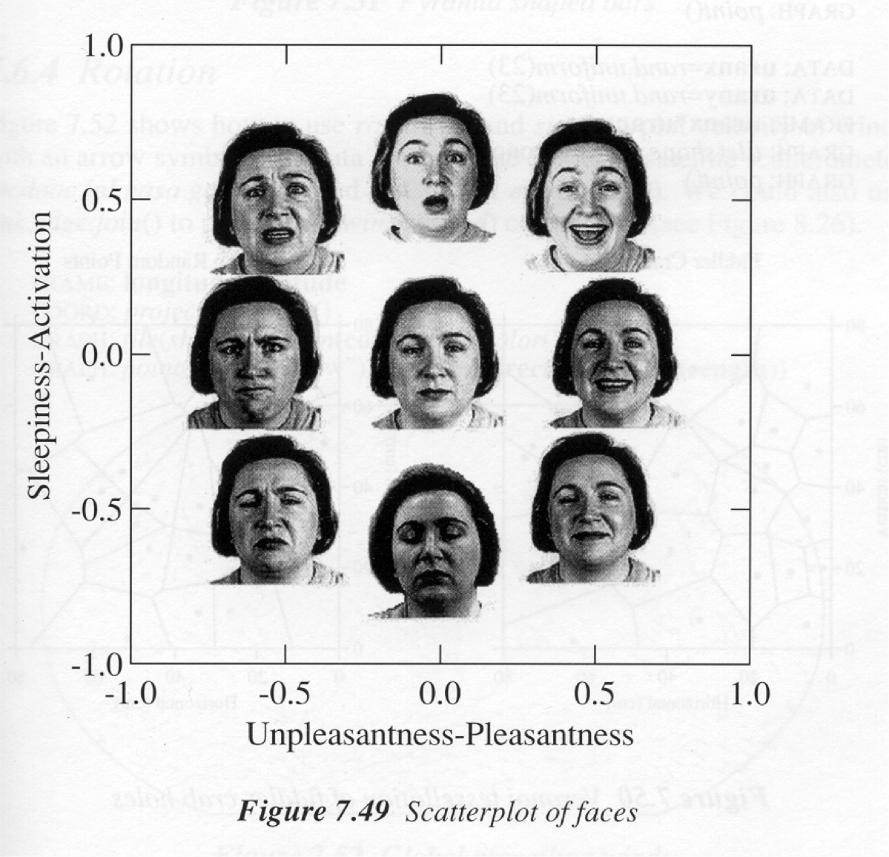

Day 2
========================================================

```{r include=FALSE}
require(mosaic, quietly=TRUE, warn.conflicts=FALSE)
require(xtable, quietly=TRUE, warn.conflicts=FALSE)
```

## Statistical Literacy

Discussion of the [sleep and dementia](http://www.npr.org/blogs/health/2012/08/27/159983037/sleepless-nights-may-put-the-aging-brain-at-risk-of-dementia?sc=ipad&f=1001) article to highlight some points that might be regarded as common sense.

A [student essay](readingReflection) about the article.

## Organization of data into tables: Variables and Cases
* Show the [spreadsheet of their data from the assignment](https://spreadsheets0.google.com/ccc?hl=en&key=tEuqmkMhi-HHMQMTjgB3jOw&hl=en#gid=0) from the [Math 155 Activity on Organization of Data](../In-Class-Activities/IntroOrganizingData.html)
* Coding of data
* The codebook --- units, methodology, meaning of levels

### Basic types of variables
* Quantitative
* Categorical
* An intermediate type --- ordinal --- and give as example a [Likert Scale](http://en.wikipedia.org/wiki/Likert_scale).
    *Example*: Pain Scale.    
    * [Wong Scale](http://pain.about.com/od/testingdiagnosis/ig/pain-scales/Wong-Baker.htm).  Why 0 to 10?
     
    * [FLACC](http://en.wikipedia.org/wiki/FLACC_scale)
    Is pain well represented by a number.  Are there different aspects to pain? Intermittant, sharp/dull, throbbing, on movement 
    
    Sometimes our impressions correspond to two or more variables.  Example from Leland Wilkinson, "The Grammar of Graphics", 1999
    


## Do the introductions!

Say something about yourself in the collaborative editor: [here](http://www.mosaic-web.org/go/firepad/examples/teamedit.html?project=Math155&doc=Intros)  

## DIY data
* Description of [elevator button experiment](https://dl.dropbox.com/u/5098197/Exercises/HTML/SM2-Chapter-3-Problems/SM2-Chapter-3-Problems-A.html?access=ISMf12#336).

Form groups for the elevator experiment ... Divide up into groups of 2 to 4.  Make a Google spreadsheet and share it with the other people in your group.  Enter some data about yourselves, including your email addresses, but also including a couple of categorical variables and a couple of quantitative variables. Before Monday's class, you get together with your group members to collect the data and put it into a spreadsheet.  Then we'll know whether the close-door button does anything.  Hand in your report [here](https://docs.google.com/a/macalester.edu/forms/d/1lTnsxkagwo4SWDg7vsfCnsTPx9x0ShIIPmz7qH7Wk_I/viewform).

## Starting R
* Basic syntax, installing `mosaic` package
* Using `fetchData` to read data files
* Simple calculations on variables

### Starting up
Login to RStudio and make sure the "mosaic" box on the "Packages" tab is checked.  You'll probably need to do this only once for the semester, but if you happen to restart R, you'll need to do it again.

```{r message=FALSE,error=FALSE,warning=FALSE,echo=FALSE,results="hide"}
require(mosaic, quietly=TRUE)
```

### Basic Syntax

#### Arithmetic

Arithmetic functions: `+ - * / ^ ( )`
```{r}
2+7
2*7
2^7
```


Functions: `name( argument1, argument2, ... )`
```{r}
sqrt(4)
sin(2)
```
Named arguments: When there is more than one argument, it's convenient to be able to refer to them by their names rather than by their positions.
```{r}
seq(from=1,to=10,by=2)
seq(from=1,to=10,length=5)
```
Sometimes you'll mix named and un-named arguments. The typical pattern is that the first one or two arguments you remember by position and the remaining ones you refer to by name. The basic  principle is that things should be unambiguous.
```{r}
seq(1,10,by=2)
seq(10,from=1,length=2)
```
But better not to do this.
```{r}
seq(from=1,to=10,2)
```
Is the third argument `length=` or `to=`?  You don't really know until you try.  So use the name!

### Chaining

You can use the output of one computation as an input to the next calculation:
```{r}
sqrt((sqrt(9))^2)
```

QUESTIONS: 
* How many different calculations are being done here?  
* How could you re-organize that statement just a little bit --- moving just one symbol --- so that the output is 9.

### Assignment

You can store data and results for later use.  You referred to the stored object by a name.  The name should begin with a letter and not have any punctuation other than `.` or `_`.  Best to keep your names short, but not so short that you can't remember what's stored where.

Here's a pure math example (since we haven't learned any statistics yet!)
```{r}
legx = 7
legy = 9
hypot = sqrt(legx^2 + legy^2)
legx/hypot # Is this a sine or a cosine
ang = atan2(legx,legy) # the angle in radians
sin(ang)
cos(ang)
```
For those interested, this technique of writing statements with quantities referred to by name is called abstraction.  Just by changing the values of `legx` and `legy`, we can repeat the calculation for a different right triangle.  So the calculations can be thought of as representing the general properties of a right triangle, rather than a particular calculation for one triangle.

### Getting Data

Typically you'll use the function `fetchData()`.  It takes as an argument the name of the dataset you want to read.
```{r}
kids = fetchData("KidsFeet")
```
These data sets are coming from a web site specifically set up for Project MOSAIC.  This allows us to access textbook data with a very concise command.

You can also read in your own data.  Store it as a CSV file on your computer, upload it to RStudio, and then use the command
```{r eval=FALSE}
mydata = fetchData( ) # no argument, but you still need parens.
```
The object that is created, which I've stored into the name `mydata` is generically called a "data frame."  


### Basic operations on data in data frames
```{r}
names( kids )
nrow( kids )
mean( length, data=kids) # Note, one variable named
```

### The tilde punctuation

We'll use the "tilde" punctuation through the semester.  It can be interpreted in several different but related ways:
* "Break down by""
* "Versus" (for plots especially)
* "Modelled by"

Examples:
```{r}
mean( length ~ sex, data=kids )
median( length ~ sex, data=kids )
xyplot( width ~ length, data=kids )
```

Going a little bit further than we need to, just for fun:
```{r}
xyplot( width ~ length | sex, data=kids )
xyplot( width ~ length, groups=sex, data=kids )
```

And some statistical graphics:
```{r}
histogram( ~ width, data=kids )
densityplot( ~ width, groups=sex, data=kids )
bwplot( ~ width, data=kids )
bwplot( width ~ sex, data=kids )
```