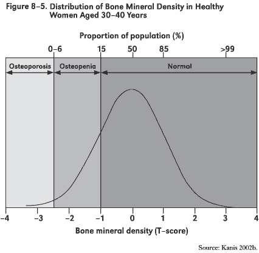

# Day 6 Notes

```{r include=FALSE}
require(mosaic)
opts_chunk$set(tidy=FALSE,fig.width=5,fig.height=4,out.width="60%",dev="svg")
options(width=60)
```

## Announcements

### Preceptors
**Preceptors** are now organized.  On the course front page, there is a schedule of preceptor office hours.  These will be the same each week.  If one of them has to be cancelled for some reason, it should show up on the front-page schedule.

Let's walk to the reading room.

### Exams

The mid-term and final exams have been scheduled.  The final exam date is extremely inconvenient.  Two alternative times earlier in exam week have been scheduled.  You may not be able to make either or both of them.  Sorry!

### ScoreR and RStudio

*ScoreR* seems to be working.  RStudio seems to be working.  Here's the plan ...  I'll start to collect the answers within a couple of days of the date on which they listed on the syllabus

### Pace

We're going to pick up the pace of the class.  For the next 8 weeks or so, the class will move along at a good clip.  **Then we will slow down** for the end of the semester.  Everyone is so crazy and stressed at the end of the semester that they don't learn anything.


## Quick review of density and distributions

Explain the density plot by reference to the dotplot of points at the bottom of the figure.  The height of the graph shows how dense the points are.

More technically, imagine a graph --- the cumulative distribution function --- showing the fraction of cases that fall below a given value versus that given value.  This will be a upward stepping graph, like this:
```{r}
with(data=Galton,plot(ecdf(height))) # not a command the students need to know
```
The density plot is the derivative of this graph.  Note that if you integrate the derivative from $-\infty$ to $\infty$, you'll get 1, the total of increase in the original function.  In other words, the area under the entire density curve is 1.  That's what determines the units on the vertical axis of the density curve.

When to use each:
* Histogram: rarely.  Instead, use a density plot
* Density plot: when there is just one or two distributions you want to compare.
* Box-and-whisker plot: When you are comparing two or more distributions, or when you want to highlight outliers.

```{r}
bwplot(height ~ sex, data=Galton)
```


#### What's an outlier.

The 1.5 IQR rule of thumb.  Demo this by showing a box-and-whisker plot with some outliers and showing how the whiskers extend to 1.5 IQR from the first and third quartiles.

### Computational Exercise: Testing Robustness

Technique: Creating an Outlier

Let's change one height value in the Galton data to be an outrageous outlier:
```{r}
bogus = Galton
bogus$height[25] = 800 # You don't need to use this command
```

Play with the various measures and see which ones are very different between `g` and `bogus`.

### Example: Osteopenia.

Here's a quote from [Wikipedia](http://en.wikipedia.org/wiki/Bone_mineral_density): 
> Osteopenia is a condition where bone mineral density is lower than normal. It is considered by many doctors to be a precursor to osteoporosis. However, not every person diagnosed with osteopenia will develop osteoporosis. More specifically, osteopenia is defined as a bone mineral density T-score between -1.0 and -2.5.

The article goes on:
> The definition has been controversial. Steven R. Cummings, of the University of California, San Francisco, said in 2003 that "There is no basis, no biological, social, economic or treatment basis, no basis whatsoever" for using one standard deviation. Cummings added that "As a consequence, though, more than half of the population is told arbitrarily that they have a condition they need to worry about." [Quoted from this Gina Kolata article](http://www.nytimes.com/2003/09/28/us/bone-diagnosis-gives-new-data-but-no-answers.html)

 

Bone density falls with age.  The T-score is really just a Z-score, but compares a person to the distribution of young people.  [Some graphs](http://courses.washington.edu/bonephys/opbmd.html)

Osteopenia is defined so that about 1/6 of young people have it and much larger fractions of old people will have it. 

### Example: One-Day Changes in Stock Prices

The stock market goes up and down every day.  By how much?  
```{r}
apple = fetchData("M155/Stocks/aapl.csv")
netflix = fetchData("M155/Stocks/nflx.csv")
facebook = fetchData("M155/Stocks/fb.csv")
```

* What are the names of the variables? What is a case?
* Create a new variable, `change` that is the ratio of the closing price to the opening price.
```{r}
apple = transform(apple, change=Close/Open)
netflix = transform(netflix, change=Close/Open)
facebook = transform(facebook, change=Close/Open)
```

What's the distribution?  What's a typical value?  Do the stocks have different typical values?  What does the standard deviation tell you here?


#### Aside:

If you want to plot out the values versus time, you need to turn the Date variable into a format that can be used by R.  Here's how:
```{r}
fetchData("getDJIAdata.R")
apple = fixStockDate(apple)
netflix = fixStockDate(netflix)
facebook = fixStockDate(facebook)
```

### Activity: Sketch Some Distributions

* Household Income in the US
* Household Net Worth in the US
* College tuition ([resource](http://centerforcollegeaffordability.org/archives/6728))
* Number of courses completed by Macalester students.
* Age of Macalester students.
* House prices
* Body weight of adults
* SAT scores
* Human gestational length
* Infant birth weight


You might want to start with an estimate of the mean or median and the 95% coverage interval.  
Also, think about the tails of the distribution.  
* Are they likely to stretch out one way or the other in an asymmetric way, that is whether the distribution is likely to be skew one way or the other.
* Are they likely to be truncated.
* From your sketch, estimate the standard deviation and the IQR.  Is one easier to estimate than the other.


Spend 3 minutes using the web to see if you can get any confirmation from the Internet for your estimates.

* <image src="http://upload.wikimedia.org/wikipedia/commons/a/aa/Distribution_of_Annual_Household_Income_in_the_United_States.png" width="80%">
* [Distribution of income](http://en.wikipedia.org/wiki/Wealth_in_the_United_States#Distribution_of_wealth) --- Why is the mean so much larger than the median?  What would the box-and-whiskers plot look like?

### Measurement and measurement bias
* Instrumental or procedural error. Measure heights of people with a ruler, but with the ruler not level.
* Subject or response bias: "How many of you are intravenous drug users?"
* Global warming. Measurement gauges have been encroached on by urbanization.


### Sampling and sampling bias
* Self-selection bias for surveys
* Problems with convenience samples: e.g., interview students at library on Friday night about their study habits
* Selection and survival bias: we don't see the kids who drop out of school, tracking a random sample of Alzheimer's patients to see how long they survive --- you're more likely to sample those who survive a long time.

### Random sampling
* Sampling frame and formal methods.  Use `sample` 

#### In-Class Activity

* Sampling Bias Activity `s = select.books()` which needs to be proceeded by
```{r}
fetchData("simulate.r")
```

[Instructor's write up](../Activities/SelectingLibraryBooks.html)


## Means and Models

We've described statistics like the "mean" in terms of a procedure: add them up and divide by $n$.  Now we're going look at them in terms of a **criterion** for choosing a model.

### Basic vocab: Grand and Group-wise Means

* Group-wise means.  Examples:
```{r}
mean(height ~ sex, data=Galton)
mean(height ~ sex + nkids, data=Galton)
mean(height ~ sex + ntiles(father), data=Galton)
```

In each of these, we are computing the means of different groups, with the groups specified to the right of the tilde `~`.

It's possible to put the calculation of the overall, or **grand mean** in this same notational framework.  We need a symbol to stand for "everybody's in just one group," that is, a categorical variable with just one level.  Of course, such a variable would also be ordinal (there's just one level --- it's always in order!), or even numerical (the same number for everybody).  The standard way to do this is with the quantity `1`, which means a variable that's 1 for everybody.

* Grand mean.  Example:
```{r}
mean(height ~ 1, data=Galton)
mean(height, data=Galton)
```

If you're thinking, this is a waste of time, why not just use `mean(height, data=Galton)`, there's something to be said for you point of view.  The advantages of `1` won't become evident for about a week.

### Basic vocabulary: Model values

The reports from `mean()` tell you about the groups, but not the individuals directly.  To find the corresponding group value for each individual, look up the group that the person is in and assign the corresponding mean value to that person.  

Activity: Do this by hand for the first several Galton cases:
```{r}
mean(height ~ sex, data=Galton) # grouping A
mean(height ~ ntiles(father), data=Galton) #grouping B
head(Galton) 
```

This is a straightforward calculation, but tedius.  The `mm()` function makes this easier.
```{r}
modA = mm(height ~ sex, data=Galton)
modB = mm(height ~ sex + ntiles(father), data=Galton)
Galton = transform(Galton, Avals=fitted(modA), Bvals=fitted(modB))
head(Galton)
```

We call these **fitted model values**.  

* **model** because those values give a representation of the heights that's somewhat simplified.
* **fitted** because the values are chosen to be the "best" possible values in a sense.

```{r}
xyplot(height ~ sex, data=Galton)
plotPoints(fitted(modA) ~ sex, data=Galton,add=TRUE,col="red",pch=20)
plotPoints(fitted(modB) ~ sex, data=Galton,add=TRUE,col="green",pch=20)
```

The **residual** is the difference between the fitted model values and the actual measured value for each case.

The fitting process makes the residual as small as possible in two different ways:

1. The mean residual is always zero.  That is, the positive residuals exactly cancel out the negative ones.
2. The spread of the residuals, as measured by the standard deviation, is as small as possible.  Any other different calculation for the groupwise quantities of these groups will give a value that's larger for the spread of the residuals.

### Partitioning

The variance of the residuals plus the variance of the fitted equals the variance of the measured values.  

This is much like the Pythagorean theorem.

It means we can measure "how much" variation has been "explained" by the model, and how much remains unexplained.

Try it on any grouping you like. 

**ACTIVITY**: Construct models of the CPS85 data set, using different explanatory variables.
