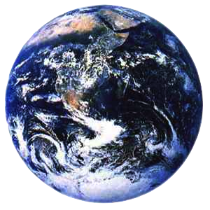
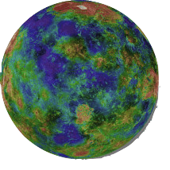
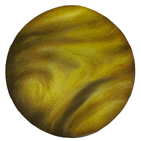

# Day 27 Notes, Nov 6, 2013

```{r include=FALSE}
require(mosaic)
```

# Today's topic: Hypothesis Testing

Two related concepts are needed:

1. Conditional Probability
2. Hypothetical Reasoning

## Conditional Probability and Bayes Rule

Mammography and breast cancer.  
 
* Sensitivity is 90%
* Specificity is 90%

Let prevalence be 1%.  If you have a positive mammogram, what's the probability of breast cancer.

### Bayes Rule in Algebraic Form

$$ p( condition | testres ) = \frac{p( testres | condition ) \times p(condition)}{p(testres)}$$

These parts of the expression have technical names:

* Likelihood: p( testres | condition )
* Evidence: p(testres | condition)/p(testres)
* Prior: p(condition)
* Posterior: p(condition|testres)

### Ivory-Billed Activity

Just the Bayesian Approach

### The Multi-World Metaphor


## The Multi-World Metaphor for Statistical Inference 

Motto: *Always know what world you are thinking about.*



We want to know which hypotheses are true on Earth and which are false.


The planets involved in statistical inference are:


Planet Sample | Planet Null | Planet Alt
--------------|-------------|--------
 |  |  


How to travel to the different worlds ...

* Planet Sample: resampling
* Planet Null: shuffling
* Planet Alt: You need to construct such a world (we'll pick this up today)

### Other hypotheses, with content

Side-by-side comparison: <http://en.wikipedia.org/wiki/File:PileatedIvoryWoodpecker.svg>

[Some of the photographic evidence](http://www.fishcrow.com/pearl29mar08.html)
The Ivory Billed woodpecker from a [hypothesis testing perspective](bayes-approach.pdf) second page.

How to travel to the different worlds ...

* Planet Sample: resampling
* Planet Null: shuffling
* Planet Alt: You need to construct such a world (we'll pick this up in a few days)

We've already done several examples using resampling --- the idea is to see how much sampling variation there would be if the world were just like our sample.

Now to do shuffling.

Work with model coefficients and $R^2$ from a few models, with shuffling of an explanatory variable, or shuffling of the response.

Example: Sector of the economy and wages
```{r}
mod = lm( wage ~ sector*sex+ educ + exper, data=CPS85 )
real = r.squared(mod)
real
```

Now go to Planet Null
```{r}
s = do(1000)*lm(wage~shuffle(sector)*sex + educ + exper, data=CPS85)
densityplot(~r.squared, data=s)
tally( ~r.squared >= real, data=s )
```

What's the p-value?

Do the same on a coefficient and look at the two-tailed test.

### Stocks on Planet Null

```{r}
fetchData("getDJIAdata.R")
djia = getDJIAdata() # djia-2011.csv is the basic file
xyplot( Close ~ Date, data=djia)
```

Look at the day-to-day differences in log prices:
```{r}
dd = with( djia, diff( log(Close)))
mean(dd)
```

Subtract out the mean, shuffle, cumulative sum, and exponentiate to create a realization:
```{r}
ddnull = dd - mean(dd)
sim = exp(cumsum(shuffle(ddnull)))
xyplot(sim ~ Date, data=djia)
```

### Drunk Driving Example

Planet Null: 
* Set up a roadblock, pull out the people who are not drunk.  Measure their results.

Planet Alt
* Take the drunk people, measure their results.

What's the decision threshold?

What's the 


### App for playing with Significance and Power

```{r eval=FALSE}
fetchData("mHypTest.R")
mHypTest() # by default, a coefficient
```