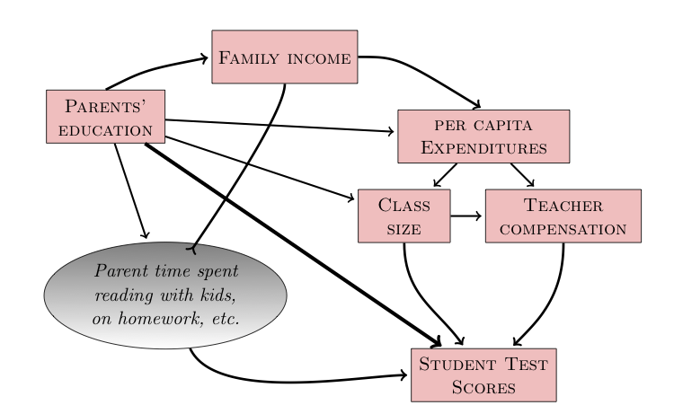

# Day 39 Notes, Dec. 6, 2013

```{r include=FALSE}
require(mosaic)
```

$latex \newcommand{\ensuremath}[1]{#1}
\newcommand{\pathway}[1]{\hbox{#1}}
\newcommand{\causes}{\ensuremath{\Rightarrow}}
\newcommand{\causedBy}{\ensuremath{\Leftarrow}}
\newcommand{\correlatedWith}{\ensuremath{\nLeftrightarrow}}$

#### Quotes for the Day: 

> "Theorie ist, wenn man alles weiss, aber nichts funktioniert. Praxis ist, wenn alles funktioniert, aber niemand weiss warum. Hier ist Theorie und Praxis vereint: nichts funktioniert… und niemand weiss wieso!" --- **Albert Einstein**
    
> In a theory, we know everything, but nothing actually works. In practice, things work, but nobody knows why.  When theory and practice go hand in hand, nothing works and nobody knows why.  

> A theory is something nobody believes, except the person who made it. An experiment is something everybody believes, except the person who made it. --- **Albert Einstein**


## Simulating Causation

To test out some ideas about model building and causation, you're going to work with some simulations.  The simulations don't necessarily correspond to the real world, that's not the point.  But in the simulations we know exactly what's going on, so we can see if our methods are giving accurate results.


### Software for Simulation

Load in some simulation software.

```{r message=FALSE,error=FALSE,results=TRUE}
fetchData("simulate.r")
```

### Example: Campaign spending

```{r}
campaign.spending
equations(campaign.spending)
```

Run the simulation
```{r}
res = run.sim(campaign.spending, 435)
summary(lm(vote ~ spending, data=res))
```

The units of the `spending` coefficient are percentage points per spending units (perhaps, millions of dollars).  The spending ranges from 0 to 100 (roughly).  So increasing spending by 20 spending units decreases the vote by about 7 percentage points, easily able to affect the outcome of the election.

This is very precise, but it is wrong.
```{r}
summary(lm(vote~spending+popularity, data=res))
summary(lm(vote~spending+polls, data=res))
```

### Example: Aspirin and Stroke

One of the simulations

```{r}
aspirin
equations(aspirin)
```
A big study:
```{r}
studyData = run.sim(aspirin, 10000)
coef(summary( glm( stroke=="Y" ~ mgPerDay, data=studyData, family="binomial")))
coef(summary( glm( stroke=="Y" ~ mgPerDay + sick, data=studyData, family="binomial")))
```

### An example hypothetical causal network

If we want to study the direct link between class size and test scores, we need to block the backdoor pathways.



### Chains in Causation

Following the convention used throughout the book
* $A$ is a response variable
* $B$ is an explanatory variable
* $C$ is a covariate.  We'll also use $D$, $E$, etc. as covariates and $U$ or $?$ as unobserved variables.

#### Three linear pathways:
* **Causal mediator**: $latex A \causedBy C \causedBy  B$.  Simulation: `cnet.mediator`
* **Common cause**: $latex A \causedBy C \causes B$. Simulation: `cnet.common.cause`
* **Witness**: $C$ is caused by both $A$ and $B$: $latex A \causes C \causedBy B$. Simulation: `cnet.witness`

#### A circular pathway
* A **recurrent network** (or, closed loop of causation): : $latex A \causes B \causes C \causes A$ or the variations.

We won't deal with these.  They raise questions about "when".

#### Correlation

The notation $latex A \correlatedWith B$ means that there is a non-causal connection between $latex A$ and $latex B$.  This must be because there is some unobserved variable $U$ producing the correlation, such as 

1. $latex A \causedBy U \causes B$
2. $latex A \causes U \causedBy B$

Note that if either of the arrows went the other way, we'd simply have $U$ being a causal mediator.

We'll see later that (1) is not a possibility if $U$ is unobserved and unconnected to anything else.

### The Rules for Observing or Blocking a Pathway

Remember, we want to study the **causal** relationship between $latex A$ and $latex B$ and are trying to decide whether to include the covariate $latex C$.

* Causal mediator: Including $latex C$ **blocks** the pathway, which is otherwise open.
* Common cause: Including $latex C$ **blocks** the pathway, which is otherwise open.
* Witness: Including $latex C$ **opens** the pathway, which is otherwise blocked.

### Confirming these rules

Run a simulation of $latex A$ against $latex B$.  When the coefficient in a model is zero, the pathway between $latex B$ and $latex A$ has been blocked. 

#### Mediator

```{r}
equations(cnet.mediator)
s = run.sim(cnet.mediator, 1000 )
coef( summary( lm( A ~ B, data=s )))
```
The above model indicates that the pathway is open.

Including the covariate $latex C$ blocks the pathway between $latex B$ and $latex A$.
```{r}
coef( summary( lm( A ~ B + C, data=s )))
```

### Common Cause

```{r}
equations(cnet.common.cause)
s = run.sim(cnet.common.cause, 1000 )
coef( summary( lm( A ~ B, data=s )))
```
The above model indicates that the pathway is open.

Including the covariate $latex C$ blocks the pathway between $latex B$ and $latex A$.
```{r}
coef( summary( lm( A ~ B + C, data=s )))
```

### Witness

```{r}
equations(cnet.witness)
s = run.sim(cnet.witness, 1000 )
coef( summary( lm( A ~ B, data=s )))
```
The above model indicates that the pathway is blocked.

Including the covariate $latex C$ opens the pathway between $latex B$ and $latex A$.
```{r}
coef( summary( lm( A ~ B + C, data=s )))
```

### The Jock Network 

Imagine that we wanted to study the relationship between athletic ability and SAT scores.  The conventional wisdom is that athletes tend to have lower test scores.  The `jock` network implements one hypothesis.

```{r}
s = run.sim(jock, 1000)
head(s)
```

In practice, SAT and athletic ability data on an individual might be available via a college, so let's pull out just the cases that are in college:
```{r}
college <- subset(s, College=="Yes")
```

Look at the relationship between IQ and Athletic:
```{r}
coef(summary(lm( IQ ~ Athletic, data=college)))
```

There is a relationship!

Now look at the entire set of data:
```{r}
coef(summary(lm(IQ~Athletic, data=s)))
```
The relationship has disappeared.  Why?

ACTIVITY: Look at the structure and equations of the `jock` network and explain.

### In-Class Activity

Here is the complete set of simple causal pathways among three variables.

* In each case, write down whether the pathway is a mediator, a common cause, or a witness.
* We've only studied the pathways with C in the middle.  For the others, figure out whether including C as a covariate opens or blocks the pathway between A and B.
* Come up with a setting which assigns a meaning to A, B, and C.  Example: B is taking nitroglycerin, C is dilation of the arteries, A is getting a headache.  

The possibilities for who can be in the middle: $latex A$ or $latex B$ or $latex C$

#### $C$ in the middle

* $latex B \causedBy C \causes A$
* $latex B \causedBy C \causedBy A$
* $latex B \causes C \causedBy A$
* $latex B \causes C \causes A$

#### $A$ in the middle

* $latex B \causedBy A \causes C$
* $latex B \causedBy A \causedBy C$
* $latex B \causes A \causedBy C$
* $latex B \causes A \causes C$

#### $B$ in the middle

* $latex A \causedBy B \causes C$
* $latex A \causedBy B \causedBy C$
* $latex A \causes B \causedBy C$
* $latex A \causes B \causes C$


### Intent to Treat

In reality, we're not going to have perfect compliance with our instructions.  Some people given a placebo will take aspirin anyways.  Some people won't take their aspirin.

To simulate this, we'll tell the program to add in an influence without severing the connection from `sick` to `mgPerDay`.

```{r}
experiment.size=200
influence = resample( c(30,70), experiment.size)
Ex2 = run.sim( aspirin, experiment.size, mgPerDay=influence, inject=TRUE )
```
Show that with `inject=TRUE`, the values of `mgPerDay` reflect both the input and the variable `sick`

Now build the model:
```{r}
coef(summary( glm( stroke=="Y" ~ mgPerDay, data=Ex2, family="binomial")))
coef(summary( glm( stroke=="Y" ~ mgPerDay + sick, data=Ex2, family="binomial")))
```

The result is still ambiguous.  (A larger experiment would fix this)

**Intent to treat** means to use the assigned values rather than the measured values.

```{r}
coef(summary( glm( stroke=="Y" ~ influence, data=Ex2, family="binomial")))
coef(summary( glm( stroke=="Y" ~ influence + sick, data=Ex2, family="binomial")))
```

This idea of using **intent** rather than the actual treatment is counter-intuitive.  But it's easily understood in terms of the causal diagrams.  There's no back-door pathway from **intent** to **stroke**.